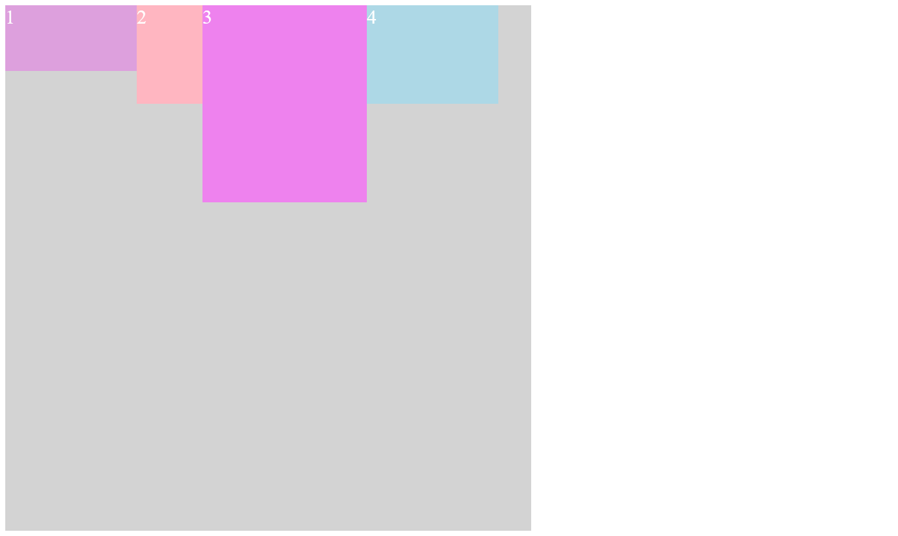

# Flexbox Basics - 09/19/2025

## 📖 What I've Learned
Flexbox is a layout model in CSS that allows you to arrange elements inside a parent container, called the *flex container*.  
The `display: flex;` property is applied to the parent, which then controls the positioning and alignment of its child elements.

